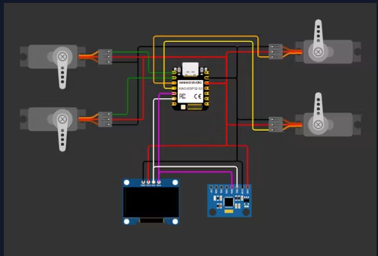
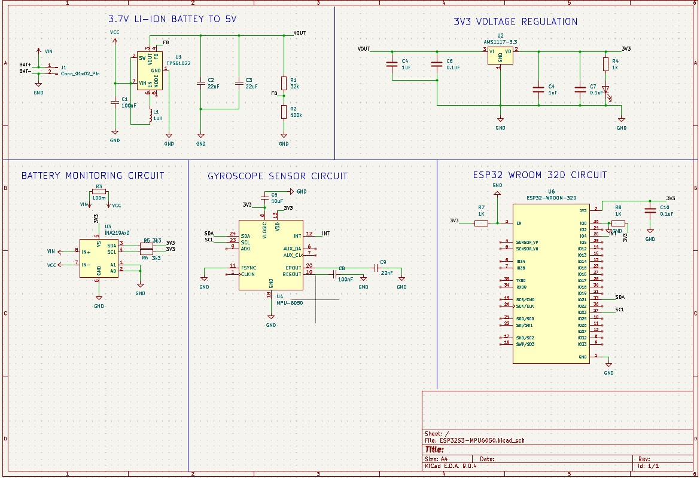
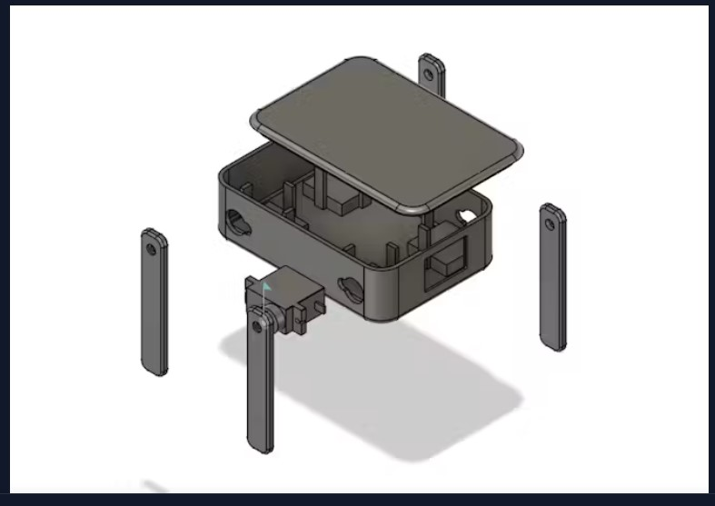
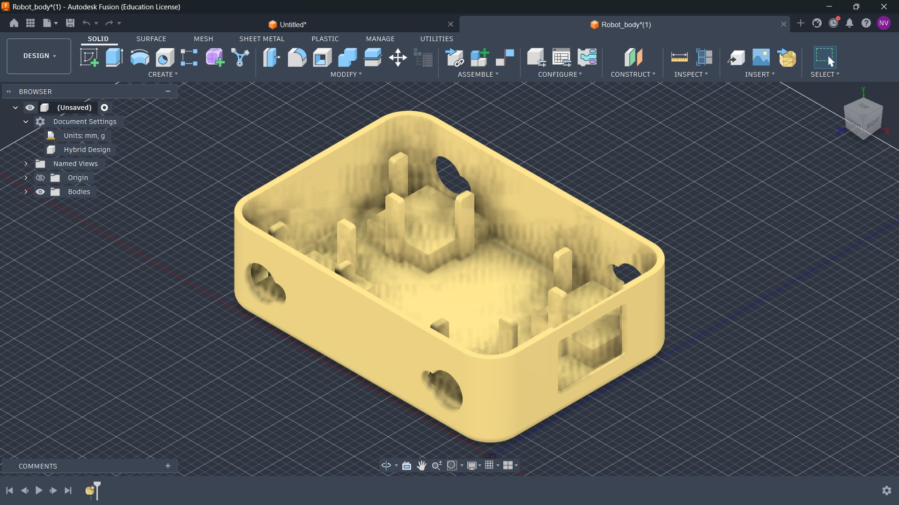
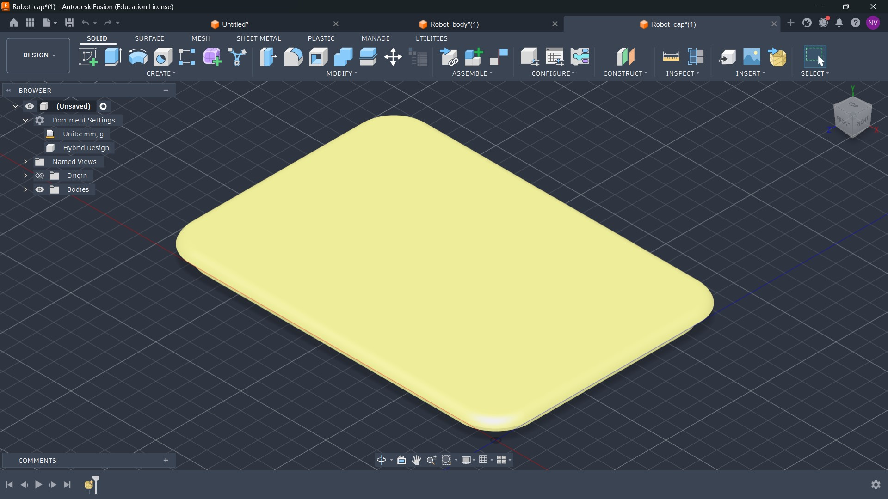
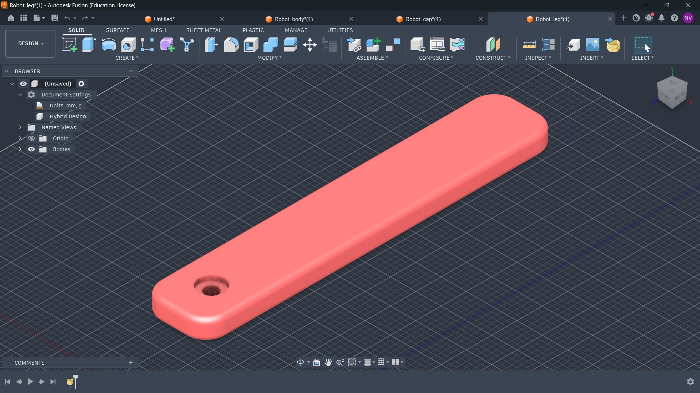
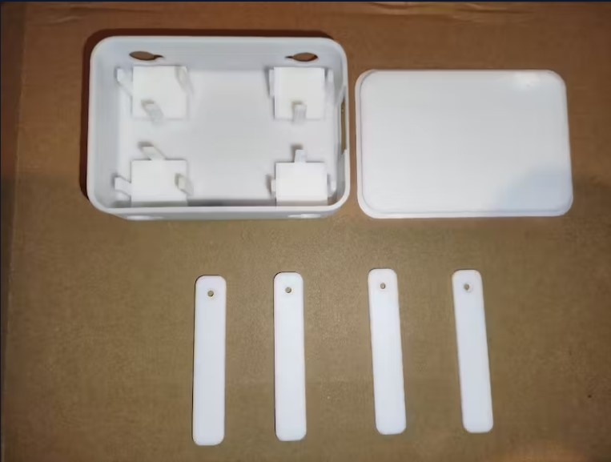

# DeskHub - Emotionally intelligent Desktop companion robot

DeskHub is a small, expressive desktop companion that responds to your interactions, shows emotions on its OLED face, 
and features a slick 3D-printed body that adds a professional finish to its charming personality.

## Features
3D-Printed Casing  
Emotion System - DeskHub reacts with happiness, tiredness, or excitement based on how you interact.  
OLED Expressions - Displays animated faces that shift with mood or environment.  

# Components
## Electronics
ESP32S3 – The main brain of the robot.  
4x DFRobot Micro Servo Motors – These handle leg movements to create an expressive, animated walk.  
MPU6050 Motion Sensor – Gives the robot the ability to detect orientation and movement, making interactions more dynamic.  
0.96" OLED Display – Used to show a wide range of animated eyes and emotions, giving DeskHub a personality.  
3.7V Lithium-ion Battery – Keeps DeskHub powered while staying compact and rechargeable.  

### PCB schematic

## Enclosure
Designing a compact and modular shell that can house all electronics  
Creating cutouts for the OLED display, servo wires, and switches  
Ensuring the structure was lightweight enough not to strain the servos  

### Fusion Design
#### Body

#### Cap

#### Legs

## 3D printing

